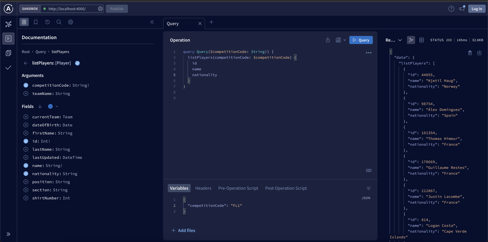

Football challenge

1. Requirements
- Node.js v18 or higher
- NPM v8 or higher
- Postgresql
- Docker (optional if you want to use this way)


2. Installation

2.1 Old Rules: without Docker

- Configure your .env copying from .env.example, and fill the variables FOOTBALL_TOKEN is required to import data

```
    npm ci  // this install all dependencies exactly as package-lock.json
    npm run build
    npm run start
```
2.2 With Docker

- Run docker compose to deploy a postgresql container and a node container where this project will be ready to test.
- This docker compose configuration is only for testing mode, because we would need to make changes in order to guarantee the security of production environment.
- You don't need to create a .env when you use this way.
- If you see the docker-compose.yml file, you can test the project without doing changes on FOOTBALL_TOKEN in order to see how the project manage the errors. If you want to test the import data you will need to replace by FOOTBALL_TOKEN from https://www.football-data.org/client/register

```
docker compose up -d --build
```

3. Usage

- Go to http://localhost:4000 you will able to see apollo sandbox with the available queries and mutations.

- Execute the mutation importCompetition with code as parameter to import data from football-data.org


- Execute the query showTeam with name to get the data imported.


- Execute the query listPlayers with competitionCode as parameter and teamName as optional parameter.



3. Notes

- We use the football-data.org API, so you need to have an API token to use this project.
- We use Apollo-graphql, so you can use the playground to test the queries and mutations.
- This project is using TypeOrm, you need to create the database on postgresql and configure the.env file (if you dont use my docker-compose.yml).
- The unit tests were made with Jest, you can run them with npm run test.

4. How I started to build this

- I based on postman file found on https://www.getpostman.com/collections/f3449621c47b66b53725 provides by [Football Data](https://www.football-data.org/)
- I did minimal changes on this postman collection in order to clarify endpoints and parameters
- I used this package `postman-to-openapi` to generate open api file
- I used this package `openapi-typescript-codegen` to generate typescript files as sdk from Footbal Data.
- I used this package `@graphql-codegen` to generate typescript interfaces from graphql notation.
- I used [TypeORM](https://typeorm.io/) because is a really good ORM for typescript projects and if you want, you can use any relational database like postgres, mysql, mssql, etc.